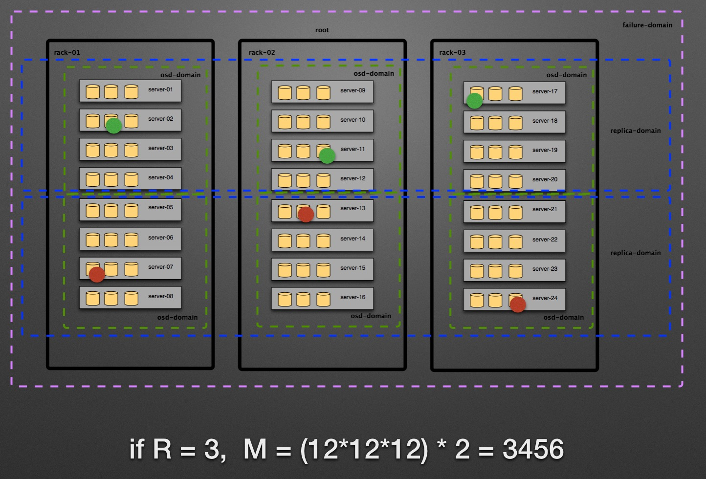

## 1. 计算持久性
   持久性是数据丢失的概率，可以用于度量一个存储系统的可靠性，俗称 “多少个9”。数据的放置(DataPlacement)决定了数据持久性，而Ceph的CRUSH MAP又决定了数据的放置，因此CRUSH MAP的设置决定了数据持久性。但是，即时我们知道需要修改CRUSH MAP的设置，但是我们应该怎么修改CRUSH MAP的设置呢，我们该如何计算数据持久性呢？

   我们需要一个计算模型和计算公式，通过以下资料，我们可以构建一个计算模型和计算公式i

   最终的计算公式是： P = func(N, R, S, AFR)

    P: 丢失所有副本的概率
    N: 整个Ceph Pool中OSD的数量
    R: 副本数
    S: 在一个Bucket中OSD的个数
    AFR: 磁盘的年平均故障率

这个计算模型是怎么样得到计算公式的呢？下面是4个步骤。

    先计算硬盘发生故障的概率。
    定义哪种情况下丢失数据不能恢复。
    计算任意R个OSD发生故障的概率。
    计算Ceph丢失PG的概率。

硬盘发生故障的概率是符合泊松分布的：

    fit = failures in time = 1/MTTF ~= 1/MTBF = AFR/(24*365)
    事件概率 Pn(λ,t) = (λt)n e-λt / n!

Ceph的每个PG是有R份副本的，存放在R个OSD上，当存有这个PG的R个OSD都发生故障时，数据是不可访问的，当这R个OSD都损坏时，数据是不可恢复的。

计算一年内任意R个OSD发生相关故障概率的方法是：

    计算一年内有OSD发生故障的概率。
    在Recovery时间内，(R-1)个OSD发生故障的概率。
    以上概率相乘，就是一年内任意R个OSD发生相关故障概率，假设是 Pr。
    N个OSD中，任意R个OSD的组合数是C(R, N)。

因为这任意R个OSD不一定存有同一个PG的副本，所以这任意R个OSD发生故障并不会导致数据不可恢复，也就是不一定会导致数据丢失。

假设每个PG对应一组OSD(有R个OSD， 称之为Copy Set)，有可能多个PG对应同一组OSD。假设有M个不同的Copy Set， M是一个非常重要的数字。

我们再来对Copy Set进行精确的定义：Copy Set上至少有一个PG的所有副本，当这个Copy Set损坏时，这个PG的所有副本也会丢失，这个PG上的所有数据就不可恢复。所以Ceph丢失数据的事件就是Ceph丢失PG， Ceph丢失PG就是有一个Copy Set发生损坏，一个Copy Set丢失的概率就是 P = Pr * M / C(R, N) 。

     详细参考: https://www.ustack.com/blog/build-block-storage-service/
               https://www.usenix.org/conference/atc13/technical-sessions/presentation/cidon


##2. 经过优化后
   
  如何减少Copy Set的个数呢？Copy Sets是和PG的映射有关的，我们从CRUSH MAP的规则和条件入手，减少Copy Set的个数。解决办法增加虚拟的Bucket: replica-domain， 不再使用rack bucket。每个PG必须在一个replica-domain上，PG不能跨replica-domain，这样可以显著减少Copy Set的个数。

   CEPH集群节点-osd-分布图 

  
  
  CEPH crush map 
  


###2.1 通过ceph-ansible部署与有云类似osd crush

####2.1.1 ceph.conf指定osd号与host对应 
    可以通过ceph.conf配置`osd.x`对应在哪个host上面, 避免osd序号分布与上图不一致.

```
[osd.1]
host = server-01 
```

     下载ceph-ansbile项目. 

```
$cat ./oad-place-table.txt >> directory-of-ceph-ansbile/roles/ceph-common/templates/ceph.conf.j2

```

####2.1.2 osd location

    打开`ceph-ansbile`的`crush_location`选项, 允许用户自定义osd crush location

```
$ vim directory-of-ceph-ansbile/group_vars/osds.yml

crush_location: true
```  

    `osd_crush_location`变量由`ceph-inventory.txt`, 在host列表里面传入ansbile, 在j版本以上的ceph, osd启动的初始化的时候自动创建不存在的bucket, 无须手动干预.

### 2.1.3 其他配置

    按照../README.md进行配置.


### 2.1.4 hosts 文件

    在默认情况下`ceph-ansbile`不会分发`/etc/hosts`dns对照文件, 如果需要可以修改directory-of-ceph-ansbile/roles/ceph-common/

    可以把ansbile 主机准备好hosts 表分发给其他各个机器

```
$cp /etc/hosts directory-of-ceph-ansbile/roles/ceph-common/templates/hosts.j2
$cp ./init-hosts.yml directory-of-ceph-ansbile/roles/ceph-common/task/init-hosts.yml
$vim directory-of-ceph-ansbile/roles/ceph-common/task/mail.yml

- include: ./checks/check_system.yml
- include: ./checks/check_mandatory_vars.yml
- include: ./init-hosts.yml
```

## 2.2 ceph 安装

### 2.2.1 执行ansbile脚本

```
$ cp ceph-inventory.txt directory-of-ceph-ansbile/
$ cd directory-of-ceph-ansbile/ 
$ ansible-playbook site.yml -k -i ./ceph-inventory.txt 
```
### 2.2.2 添加crush访问规则

   自定义crush以后,必须添加响应的访问规则, 才可以访问这个自定义crush路径的osd

   命令自带的 `ceph osd crush rule create-simple` 无法适合这种复杂的需求, 可以通过下面命令获取整个系统crush map, 并且解码为文字模式
```
// 获取系统crush map
$ ceph osd getcrushmap -o old-crush-map
// 解码为文字模式
$ crushtool -d old-crush-map -o old-crush-map.txt
```

   添加crush rule
```
$ cp old-crush-map.txt new-crush-map.txt
$ vim new-crush-map.txt

rule rule-stable-root {
        ruleset 1
        type replicated
        min_size 1
        max_size 10
        step take stable-root
        step choose firstn 1 type pod
        step chooseleaf firstn 0 type rack
        step emit
}
```

  集群包含了两个`replica domain`,  一个Copyset只能位于一个`replica domain`.  而`replica dommain`类型是pod  所以`step choose firstn 1 type pod`, 代表只取1个pod类型的bucket
  在这个`replica domain`内, 包含3个`osd domain`, 一个`osd domain` 有12个磁盘. 目标是每个备份都需要位于不同的`osd domain`. `firstn 0`, 我们取存储池备份数目个rack blucky, 例如备份数3, 在同一个replica domain 取3个rack blucky. 最终取这个`osd domain`下一层的osd bucket, 所以前面`step chooseleaf`
  添加完毕后, 需要重新编译

```
// 编译添加rule后crush
$ crushtool -c mew-crush-map.txt -o mew--crush-map
// 和并到ceph集群上
$ ceph osd setcrushmap -i new-crush-map
``` 
